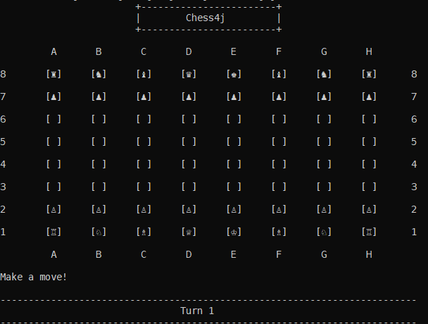

# Chess4j

This is a PvP Terminal chess game. To play you may need to make a few adjustments to your console settings as is described here:

[Changing Font of Console](https://www.cryptosys.net/firmasat/commandline-font.html)  
[Displaying unicode chess pieces in Windows-console](https://stackoverflow.com/questions/27483800/displaying-unicode-chess-pieces-in-windows-console)

Afterwards you can build an executable jar in the projects root directory by running 

    mvnw clean compile assembly:single

then execute the jar with

    java -jar ./target/chess4j.jar

If done correctly you should be able to play the game. 

     

